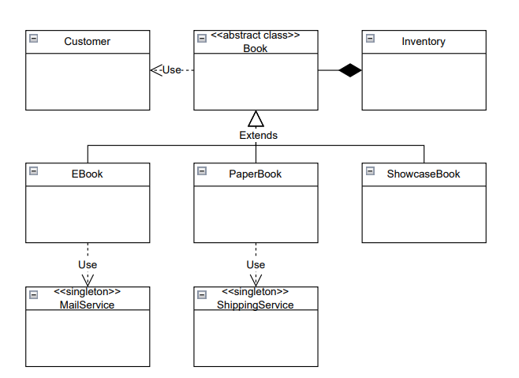

# Quantum-Bookstore



## Overview
Quantum-Bookstore is a simple Java application that simulates a bookstore system. It demonstrates object-oriented design principles, including inheritance, encapsulation, and single responsibility, while providing a clear separation between models, services, and the application entry point.

## Project Structure
```
src/
  model/
    Book.java
    PaperBook.java
    EBook.java
    ShowcaseBook.java
    Customer.java
  service/
    Inventory.java
    MailService.java
    ShippingService.java
  app/
    Main.java
assets/
  Quantum_BookStore.png
```

## Class Responsibilities
### model
- **Book (abstract):** Base class for all book types. Defines common properties and abstract methods for availability, delivery, and purchase.
- **PaperBook:** Represents a physical book with stock management and shipping logic.
- **EBook:** Represents a digital book, always available, delivered via email.
- **ShowcaseBook:** Represents a display-only book that cannot be purchased.
- **Customer:** Stores customer information and balance.

### service
- **Inventory:** Manages the collection of books, handles adding, removing, and purchasing books.
- **MailService:** Singleton service for sending eBooks via email (simulated with console output).
- **ShippingService:** Singleton service for shipping paper books (simulated with console output).

### app
- **Main:** Entry point of the application. Demonstrates adding books, creating customers, and simulating purchases with appropriate output and error handling.

## How to Run
1. Ensure you have Java installed (JDK 8+).
2. Compile the project:
   ```sh
   javac -d bin src/model/*.java src/service/*.java src/app/Main.java
   ```
3. Run the application:
   ```sh
   java -cp bin app.Main
   ```

## Usage Notes
- The `Inventory.buyBook` method now accepts a quantity parameter:
  ```java
  double paid = inventory.buyBook("001", customer, 3); // Buys 3 copies of the book with ISBN "001"
  ```
- The `purchase` method in all book types also accepts a quantity parameter.
- The system checks for sufficient stock and customer balance for the requested quantity.
- If the quantity is zero or negative, or if there is not enough stock or balance, a clear error message is shown.
- Each purchase call is for a single transaction of the specified quantity.

## Design Details
- **OOP Principles:**
  - Inheritance is used for different book types.
  - Encapsulation is maintained for all fields.
  - Single Responsibility: Each class has a clear, focused purpose.
- **Error Handling:**
  - All purchase and delivery errors are handled via exceptions, with user-friendly messages.
- **Extensibility:**
  - New book types or services can be added easily by extending the base classes or adding new service classes.
- **Singleton Pattern:**
  - Both `MailService` and `ShippingService` use the singleton pattern to ensure a single instance.
- **Separation of Concerns:**
  - Models, services, and application logic are separated into different packages for maintainability.

## Class Diagram
The following diagram illustrates the relationships between the main classes:


---

For any questions or contributions, please open an issue or submit a pull request.